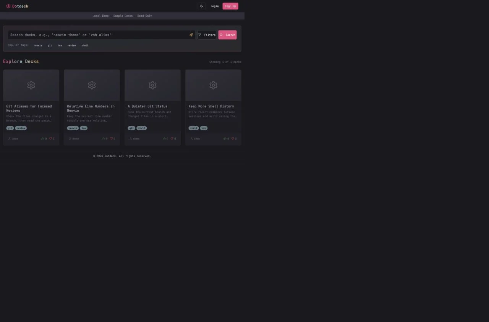
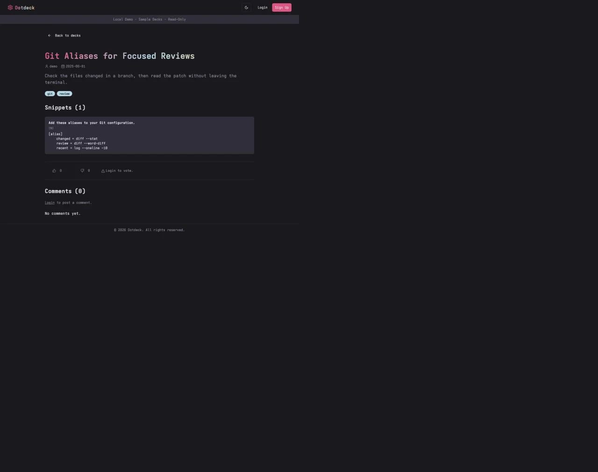

# Dotdeck

Share one useful configuration without asking someone to unpack an entire dotfiles repository. A Dotdeck entry holds a description, tags, a thumbnail, and code snippets that readers can copy individually.

I built the frontend and backend for this Creative Computing semester project. It remains a prototype; this repository includes a local preview with sample decks and a separate setup for the real API.



*The local preview uses sample data. These screenshots do not represent a live community or real usage counts.*

## Try the Interface

Use Node.js 24 LTS. Install the frontend, then start the preview from the repository root:

```sh
npm ci --prefix frontend --legacy-peer-deps
npm run demo
```

Open [localhost:4301](http://localhost:4301). Search for Git, filter by a tag, open a deck, and copy a snippet. The preview serves a read-only sample API on port 4300; it needs no database or account. Authentication, publishing, comments, and voting require the full backend.

The legacy peer-dependency flag accommodates older UI packages' React peer ranges. The lockfile fixes the installed versions; CI checks types and builds the app with React 19.



## How It Works

The Next.js frontend calls an Express API backed by MySQL. TanStack Query manages client requests. Search uses parameterized SQL `LIKE` conditions over deck titles and descriptions, with tag filtering and pagination. It is not an indexed full-text search engine.

A deck's metadata, snippets, and tags are written in one transaction. Editing locks a row belonging to the authenticated user before changing any of those records. A failed child write rolls the transaction back. That boundary matters because protecting only the deck's title can leave its snippets editable by another user.

The API also handles JWT authentication, role checks, comments, votes, and image uploads converted to WebP with Sharp. The administration interface includes prototype views; it should not be treated as a completed moderation product.

## Read the Code

| Start Here | What to Look For |
| --- | --- |
| [Deck service](backend/services/deck.service.js) | Transaction boundaries, ownership checks, and related writes |
| [Deck model](backend/models/deck.model.js) | Parameterized queries and row locking |
| [Authorization tests](backend/tests/deck-authorization.test.js) | Cross-user edits, child-only updates, and rollback behavior |
| [MySQL integration test](backend/tests/mysql-authorization.test.js) | The same boundary exercised with a real database |
| [Browse page](frontend/app/page.tsx) | Search, tag filtering, and query state |
| [Deck page](frontend/app/decks/%5Bslug%5D/page.tsx) | Snippet display, copying, comments, and votes |
| [OpenAPI specification](backend/docs/openapi.yaml) | API endpoints and request schemas |
| [Database schema](backend/schema.sql) | An empty development schema, with no user data |

## Run the Full Application

1. Install dependencies:

   ```sh
   npm ci --prefix backend
   npm ci --prefix frontend --legacy-peer-deps
   ```

2. Create a local MySQL 8 database and a user with access to it. Import [backend/schema.sql](backend/schema.sql) into that empty database.
3. Copy `backend/.env.example` to `backend/.env` and `frontend/.env.example` to `frontend/.env.local`. Set your local database credentials and generate an `ACCESS_TOKEN_SECRET` for your own environment. Do not commit these files.
4. Start the API from `backend` with `npm run dev`. Start the web app from `frontend` with `npm run dev`.

The full frontend runs on [localhost:3001](http://localhost:3001), the API on [localhost:4300/api/v1](http://localhost:4300/api/v1), and Swagger UI at [localhost:4300/api/v1/docs](http://localhost:4300/api/v1/docs). Stop the sample preview before starting the full API, since both use port 4300.

## Checks

```sh
npm test
npm run typecheck
npm run build
```

The unit tests use controlled database connections. The MySQL test runs in GitHub Actions against an isolated MySQL 8.4 service; locally it stays skipped unless `DOTDECK_MYSQL_TEST=1` and the configured database is on `127.0.0.1` with a name ending in `_test`.

CI also builds the frontend and audits production dependencies. Local checks use the same npm lockfiles.

## Credits

The interface uses Radix UI components, Tailwind CSS, Lucide icons, and Rose Pine colours. The bundled Chiosevka fonts are custom Iosevka builds, based on Renzhi Li's Iosevka, distributed under the [SIL Open Font License](frontend/public/fonts/OFL-Iosevka.md). The font metadata retains its original copyright notice.
